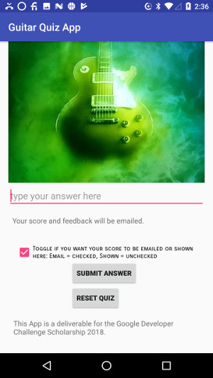

# Guitar Quiz App

This repository is a project that I created for a Udacity course. The Guitar Quiz App project is a combination of most things I learned in the latter part of the course. This project aims to create an Android App from the idea stage to building out the full app. 

### Purpose of the project

To create my own app about a topic that I desire since I have full ownership over the creative vision, planning, and development of the app. Also, figuring out the what will be hardcorded or stored in separate xml files will be practiced, as well as commenting and documenting the code.

### Prerequisites

1. To create the project, I had been following the lectures to make an interactive android app as part of Udacity's Grow With Google Challenge Scholarship: Android Basics [Udacity](https://www.udacity.com/grow-with-google)
2. I used Android Studio IDE to create the project locally on my Windows 10 machine.
3. The code is hosted in [Github Quiz App Project repo](https://github.com/roylouislgarcia/quizapp.git).
4. Download the repository and test in Android Studio IDE

### Screenshot of the project

## Author

Roy Louis L. Garcia
